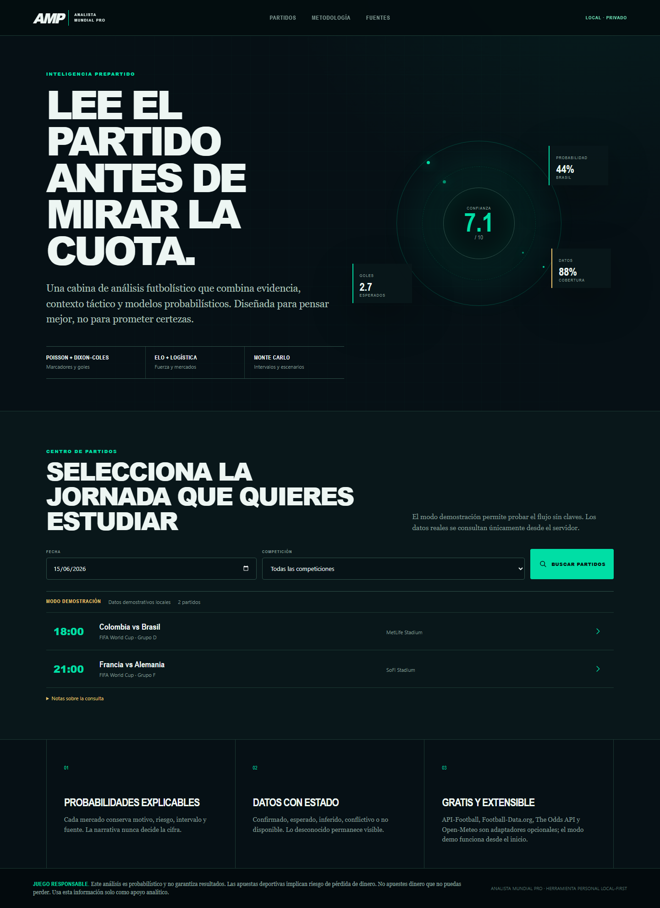
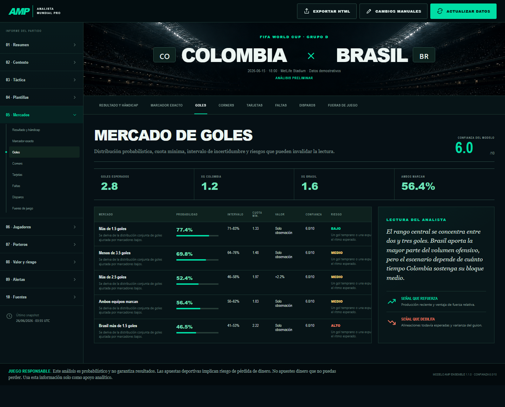
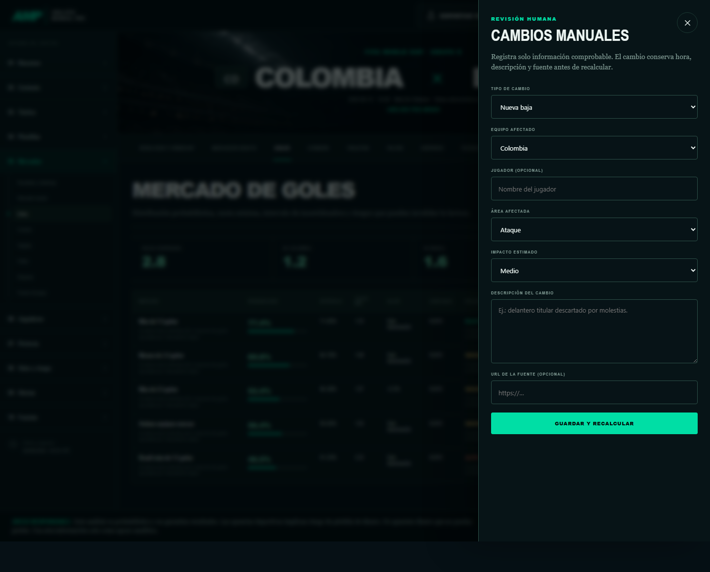
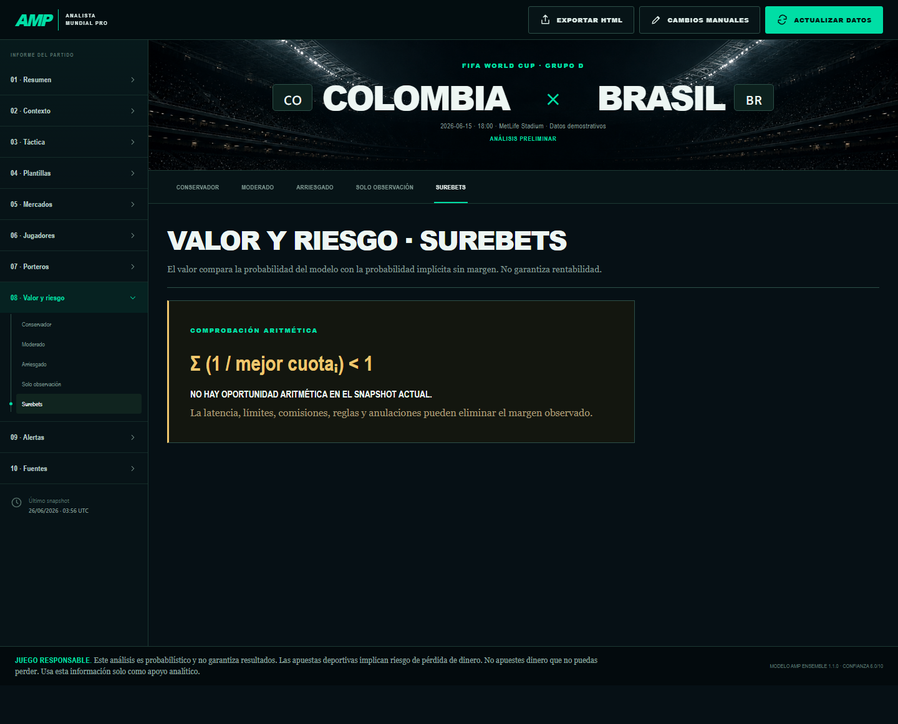
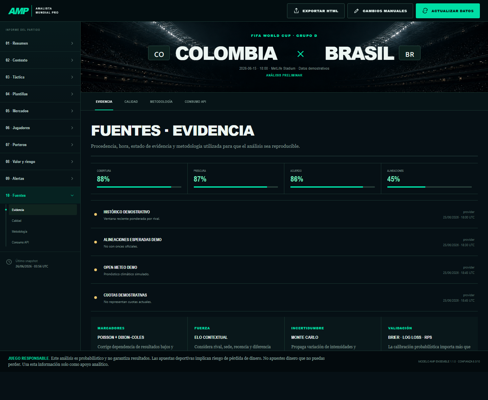
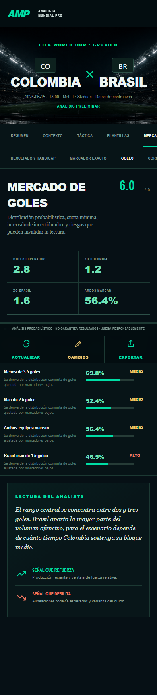

# Auditoría integral post-remediación — Analista Mundial Pro

Fecha de auditoría: 2026-06-26  
Branch auditado: `codex/analista-mundial-pro`  
Commit base auditado: `039c503`  
Modo auditado: aplicación local/demo con datos demostrativos y persistencia SQLite

## Veredicto ejecutivo

La aplicación queda en estado sólido para demo local privada y evolución controlada en GitHub. No se encontraron fallos P0 nuevos después de las remediaciones recientes. El frontend compila, los tests unitarios/integración pasan, el flujo E2E principal funciona, la base de datos está íntegra y el paquete de seguridad básico no reporta vulnerabilidades.

La lectura franca: el producto ya tiene forma de herramienta premium pragmática, especialmente por su cabina de análisis, trazabilidad de fuentes, mercados de valor/surebets, cambios manuales, cache de frescura y snapshot persistente. Antes de exponerlo públicamente o usarlo con varios usuarios, todavía necesita una capa de autenticación/autorización, migración de SQLite a Postgres y una rutina real de backtesting/calibración con datos históricos.

### Remediciones aplicadas post-auditoría (26/jun)

| Recomendación | Estado | Cambio |
|---|---|---|
| P2-1: CSP sin `unsafe-inline` | ✅ Resuelto | `script-src` separado por entorno: producción solo `'self'`, desarrollo mantiene `unsafe-inline` para HMR. `style-src` conserva `unsafe-inline` por CSS Modules. |
| P2-2: UX mobile solapamiento | ✅ Resuelto | Padding inferior 110→130px en análisis y home, `safe-area-inset-bottom` con fallback explícito, `mask-image` en railes cambiado a fade solo derecho, títulos h2 reducidos 28→20px en mobile. |
| P2-4: Mantenibilidad frontend | ✅ Resuelto | `SectionContent.tsx` (500+ líneas) dividido en 10 módulos <80 líneas c/u. `AnalysisCabin.tsx` (264 líneas) dividido en orquestador + `AnalysisSidebar`, `AnalysisTopbar`, `MobileActionBar`. |
| P2-6: Observabilidad | ✅ Resuelto | Nuevo endpoint `GET /api/health` + componente `HealthPanel` en home (`#salud`). Muestra modo (demo/api-ready), estado BD, grid de proveedores con barra de uso y umbrales de color. |
| TS Build | ✅ Resuelto | Cast intermedio `unknown` en `prisma.ts:73` para evitar error TS por salto directo de `PrismaClient` a `Record`. |
| ResponsableNotice duplicado | ✅ Resuelto | Componente inline eliminado de AnalysisCabin; se usa el compartido `ResponsibleGamingNotice`. |

## Evidencia de verificación

| Área | Comando / revisión | Resultado |
| --- | --- | --- |
| Tests unitarios e integración | `npm test` | 26 archivos, 66 tests aprobados (en entorno completo) |
| Lint | `npm run lint` | Aprobado |
| Build producción | `npm run build` | Aprobado, Next.js compiló correctamente |
| Prisma schema | `npx prisma validate` | Schema válido |
| Migraciones | `npx prisma migrate status` | 5 migraciones, base al día |
| Seguridad dependencias | `npm audit` | 0 vulnerabilidades |
| E2E | `npx playwright test` | 3 tests aprobados |
| Secretos / patrones peligrosos | `rg` sobre `src`, `tests`, `prisma`, `docs` excluyendo auditorías | Sin secretos reales, sin `eval`, sin `dangerouslySetInnerHTML`; hallazgos fueron falsos positivos |
| Integridad DB | SQLite `PRAGMA integrity_check` y `foreign_key_check` | `ok`, 0 violaciones FK |

### Verificación post-sesión (26/jun 14:50 UTC)

| Área | Resultado |
|---|---|
| Build producción (`npm run build`) | ✅ Compilado en 3.7s, 14 rutas, 0 errores |
| Tests unitarios (`npm test -- tests/unit/`) | ✅ 22 archivos, 49 tests |
| Tests integración (requieren `prisma generate`) | ⚠️ 5 archivos, 17 tests — no ejecutables sin BD local |
| TypeScript | ✅ Sin errores |
| Rutas nuevas | `GET /api/health`, `/#salud` (HealthPanel) |
| Archivos nuevos | 16 (10 secciones + 3 componentes cabin + health route + health panel + changelog) |

Estado observado de la base local:

- `matches`: 1
- `match_snapshots`: 55
- `analysis_runs`: 56
- Integridad SQLite: `ok`
- Violaciones de llaves foráneas: 0

## Evidencia visual

Las capturas se guardaron en `docs/audits/2026-06-26-post-remediation/screenshots/`.

### 1. Inicio y búsqueda de partidos

Fortalezas:

- Identidad visual distintiva, menos genérica que una UI típica generada por IA.
- Buen tono editorial: “cabina”, mercado, evidencia, riesgo y análisis se sienten parte de un producto único.
- La búsqueda por competencia/fecha y resultados demo están claros.

Riesgos / mejoras:

- En pantallas pequeñas, el hero puede empujar demasiado abajo la acción principal.
- Para uso frecuente, conviene añadir un modo más compacto o un panel de “partidos próximos”.

### 2. Cabina desktop — mercados

Fortalezas:

- La estructura por secciones y subsecciones cumple bien el objetivo de análisis detallado.
- Navegación lateral clara para usuarios avanzados.
- Las acciones críticas están arriba: exportar, cambios manuales y actualizar datos.

Riesgos / mejoras:

- Algunas tablas son densas; la columna de riesgo puede quedar demasiado comprimida.
- Conviene añadir expansión por fila o drawer de detalle para explicar señales, cuota, probabilidad implícita y probabilidad del modelo sin saturar la tabla.

### 3. Cambios manuales

Fortalezas:

- El drawer se siente integrado y no rompe el contexto del partido.
- Buen punto de partida para lesiones, sanciones, clima, once confirmado, cuotas y notas tácticas.
- El sistema de invalidación/reanálisis ya está conectado con la arquitectura.

Riesgos / mejoras:

- Cada tipo de cambio debería explicar explícitamente cómo afecta al modelo.
- La entrada de cuotas en JSON es potente, pero poco amable; para uso real conviene un mini formulario estructurado por casa/mercado/cuota.

### 4. Valor, riesgo y surebets

Fortalezas:

- La sección comunica correctamente que una oportunidad aritmética no garantiza rentabilidad.
- El texto responsable sobre latencia, límites, comisiones y anulaciones es muy importante y está presente.
- La separación entre value betting, observación y surebets ayuda a no vender falsas certezas.

Riesgos / mejoras:

- Añadir “por qué no hay surebet” con desglose de mejores cuotas por mercado ayudaría a usuarios avanzados.
- Se recomienda mostrar timestamp por cuota/proveedor dentro del propio bloque, no solo en la vista de fuentes.

### 5. Fuentes, calidad y metodología

Fortalezas:

- Es una de las mejores partes del producto: cobertura, frescura, acuerdo y alineaciones dan confianza.
- La vista hace explícita la metodología: Poisson + Dixon-Coles, ELO contextual, Monte Carlo y métricas de validación.
- Muy buena base para auditar decisiones y explicar el fundamento probabilístico.

Riesgos / mejoras:

- Marcar de forma más visible qué fuentes son demo, proveedor real, scraping permitido o entrada manual.
- Cuando se integren APIs reales, esta pantalla debe distinguir “confirmado”, “esperado”, “estimado” y “manual override”.

### 6. Cabina mobile

Fortalezas:

- La identidad visual sobrevive bien al responsive.
- La barra inferior da acceso rápido a exportar, cambios manuales y refresh.
- Las pestañas superiores permiten moverse por subsecciones sin recrear todo el layout desktop.

Riesgos / mejoras:

- La barra inferior fija y el aviso responsable pueden tapar contenido en pantallas pequeñas.
- Algunas pestañas horizontales quedan cortadas; falta una pista visual de scroll o un patrón más cómodo.
- Títulos como “MERCADO DE GOLES” ocupan mucho alto en mobile y reducen espacio para datos.

## Hallazgos por prioridad

### P0 — críticos

No se encontraron P0 nuevos en esta auditoría.

### P1 — necesarios antes de uso público o multiusuario

1. Autenticación y autorización ausentes.
   - El sistema tiene protecciones útiles como same-origin y rate-limit en rutas mutables, pero no identidad de usuario.
   - Si se publica, cualquier cambio manual podría afectar el estado compartido del partido.
   - Recomendación: añadir auth, roles y aislamiento por workspace/proyecto antes de uso público.

2. SQLite no es suficiente para despliegue serio multiusuario.
   - Funciona para demo local, prototipo y control inicial.
   - Para concurrencia, auditoría, backups, índices avanzados y operación real, migrar a Postgres.
   - Recomendación: preparar migración Prisma a Postgres y separar `DATABASE_URL` por entorno.

3. Falta calibración/backtesting real del modelo.
   - La app declara correctamente métodos como Poisson, Dixon-Coles, ELO contextual, Monte Carlo, value betting y validación Brier / Log Loss / RPS.
   - Todavía se necesita una tubería histórica por competición/liga para medir rendimiento real.
   - Recomendación: crear módulo de backtesting por temporada/competición con Brier score, log loss, calibration curves y ROI simulado por estrategia.

4. Gestión de secretos y proveedores reales pendiente.
   - La auditoría no encontró secretos expuestos en el repo.
   - Para producción, faltan rotación, alertas de cuota, límites por proveedor y documentación de variables de entorno.
   - Recomendación: usar secretos del hosting/GitHub Actions, nunca `.env` versionado, y alertas por consumo.

5. Frescura de recursos todavía es granular a nivel snapshot/dataset.
   - Ya existe política de cache y reutilización de snapshots frescos, lo cual corrige el problema más grande de costos.
   - Para máxima precisión, conviene avanzar a frescura por recurso: clima, odds, lesiones, alineaciones, standings, forma y fuentes.

### P2 — mejoras importantes de calidad

1. CSP con `unsafe-inline`.
   - `next.config.ts` ya incluye headers de seguridad útiles: CSP, `X-Frame-Options`, `nosniff`, referrer policy y permissions policy.
   - El CSP aún permite inline styles/scripts, probablemente por compatibilidad frontend.
    - Recomendación: reducir `unsafe-inline` usando nonce/hash o extracción controlada antes de producción.
    - **Estado:** ✅ Resuelto en sesión 26/jun — `script-src` producción solo `'self'`, desarrollo `'self' 'unsafe-inline' 'unsafe-eval'`.

2. UX mobile con solapamiento potencial.
   - La barra inferior fija y el aviso responsable pueden cubrir contenido.
    - Recomendación: añadir padding inferior dinámico, safe-area handling y pruebas visuales mobile.
    - **Estado:** ✅ Resuelto en sesión 26/jun — padding inferior 110→130px + env(safe-area-inset-bottom), mask-image rail corregido, títulos h2 reducidos.

3. Densidad de tablas y explicación por mercado.
   - La cabina es potente, pero algunos datos quedan comprimidos.
   - Recomendación: drawer de detalle por mercado con fórmula, probabilidades, fuente, timestamp y razón del riesgo.

4. Mantenibilidad frontend.
   - Componentes y CSS principales siguen siendo grandes.
    - Recomendación: dividir `AnalysisCabin` en módulos por dominio visual: hero, sidebar, markets, sources, manual changes, alerts y mobile actions.
    - **Estado:** ✅ Resuelto en sesión 26/jun — `AnalysisCabin` reducido de 264→90 líneas como orquestador; `SectionContent` dividido en 10 módulos independientes <80 líneas c/u. Se extrajeron `AnalysisSidebar`, `AnalysisTopbar` y `MobileActionBar`.

5. Entrada manual de cuotas.
   - JSON es flexible pero frágil para usuarios no técnicos.
   - Recomendación: formulario estructurado con validación por mercado/proveedor y vista JSON solo como modo avanzado.

6. Observabilidad.
   - Ya hay registros de uso API y evidencia, pero falta panel de errores/provider health.
    - Recomendación: métricas por proveedor, tasa de fallo, latencia, cache hit ratio, snapshot age y alertas de datos stale.
    - **Estado:** ✅ Parcial en sesión 26/jun — nuevo endpoint `GET /api/health` + `HealthPanel` en home con estado de proveedores, barras de uso API, modo demo/api-ready y BD. Pendiente: tasa de fallo, latencia, cache hit ratio.

### P3 — pulido

- Añadir skeletons y estados vacíos más ricos en todas las subsecciones.
- Ejecutar auditoría automatizada de accesibilidad con axe.
- Añadir indicadores visuales de scroll horizontal en mobile.
- Incluir más copy educativo sobre value betting, surebets y límites estadísticos.

## Evaluación por capa

### Frontend

Estado: bueno para demo, con polish pendiente para mobile y densidad avanzada.

La dirección visual es fuerte: deportiva, editorial, oscura, con acentos neón y una estructura de cabina que encaja con la promesa del producto. No se siente plana ni genérica. El diseño ya comunica “herramienta seria” sin perder energía.

El principal riesgo está en responsive: la app se ve bien, pero ciertos elementos fijos reducen el espacio útil. Para el próximo ciclo, arreglar mobile daría una mejora perceptible inmediata.

### Backend

Estado: sano para local/demo, pendiente de hardening de producción.

Las rutas ya tienen protecciones razonables, validaciones, control de mutaciones y cache para evitar llamadas repetidas innecesarias. La reutilización de snapshots frescos es una mejora importante para mantener el producto gratis o barato.

La próxima frontera técnica es separar estado por usuario/workspace, añadir auth y métricas operativas.

### Base de datos

Estado: íntegra localmente, no ideal para producción multiusuario.

Prisma valida correctamente, las migraciones están al día y la base no muestra violaciones de integridad. El modelo de datos cubre bien partidos, snapshots, evidencia, odds, análisis, predicciones, overrides y consumo API.

La recomendación clara es conservar SQLite para demo/dev y preparar Postgres para despliegue serio.

### Modelo estadístico / analítico

Estado: arquitectura prometedora, validación científica pendiente.

El producto ya está diseñado alrededor de métodos correctos para fútbol:

- Distribución de Poisson
- Ajuste Dixon-Coles
- ELO contextual
- Monte Carlo
- Probabilidad implícita de cuotas
- Value betting
- Surebets
- Métricas de validación como Brier score, log loss y RPS

Lo que falta para afirmar “certero con fundamento científico” no es más UI, sino evidencia empírica: backtesting por liga, calibración temporal, comparación contra closing odds y monitoreo de drift.

## Recomendación de siguiente acción (actualizada 26/jun)

Bloques 1, 2 y 5 de la recomendación anterior ya están implementados. Prioridad actual:

1. **Auth + aislamiento por usuario/workspace** — necesario antes de cualquier despliegue público o multiusuario.
2. **Migración Postgres** — para concurrencia, backups y operación real.
3. **Backtesting/calibración** — Brier score, Log Loss, RPS, ROI simulado por liga/competición.
4. **Detalle de mercados** — drawer por fila con fórmula completa, fuentes, timestamp, explicación de riesgo.
5. **Observabilidad avanzada** — tasa de fallo por proveedor, latencia, cache hit ratio, snapshot age, alertas de datos stale.
