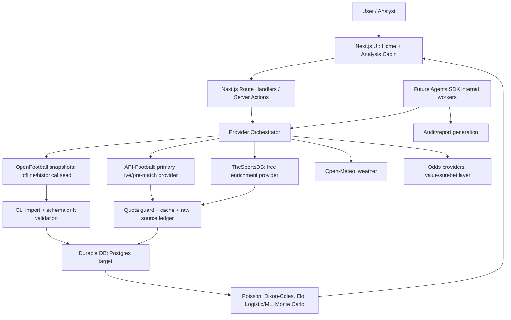

# Data Sources, Agents, and Frontend Roadmap Implementation Plan

> **For agentic workers:** REQUIRED SUB-SKILL: Use `superpowers:subagent-driven-development` (recommended) or `superpowers:executing-plans` to execute this plan.

## Goal

Convert Analista Mundial Pro from a strong demo/API-ready product into a robust, extensible football intelligence platform that can support World Cup 2026 first, then top European leagues, Champions League and other attractive markets.

## Progress Update — 2026-06-26

Task 2 has started on branch `codex/neon-postgres-integration` after the user chose Neon Postgres. The app now has a Postgres Prisma baseline, `@prisma/adapter-pg`, Neon/Netlify deployment docs, archived SQLite migrations and conditional DB tests that run when `DATABASE_URL` points to Postgres.

Verified locally without a real Neon `DATABASE_URL`:

- `npx prisma generate`
- `npx prisma validate`
- `npm run lint`
- `npm test`
- `npm run build`
- `npm run test:e2e`

Remaining Task 2 production step: configure the real Neon connection string in Netlify and run `npx prisma migrate deploy`, `npx prisma db seed`, and `npx prisma migrate status` against Neon.

This roadmap integrates:

- OpenFootball datasets as a free historical/offline base.
- TheSportsDB as a free secondary enrichment provider.
- The existing API-Football provider as the primary real-data provider when quota allows.
- A future OpenAI Agents SDK workflow for internal research/audit automation.
- A stronger, more memorable frontend inspired by the supplied World Cup prediction reference without cloning its brand or layout.
- Production hardening on Netlify, especially persistence and observability.

## Current State Assessment

Repository state observed on 2026-06-26:

- Branch: `codex/analista-mundial-pro`
- Recent commits include:
  - `1a428e8` — small UX/accessibility/defensive fixes and audits.
  - `907ccbd` — section refactor, analysis cabin refactor and health panel.
  - `cbe1ddf` — removed developer-facing copy from user UI.
  - `d206d2f` — completed Task 8 final verification.
  - `277f348` — enabled Netlify Next runtime.
  - `34b4eda` — configured API-Football quota guard.

What is already solid:

- Next.js app exists and has a distinctive visual direction.
- Home page already has hero, match finder, methodology principles and health panel.
- Provider registry exists for API-Football, Football-Data, The Odds API and Open-Meteo.
- API-Football quota policy exists and protects the free daily allowance.
- `GET /api/health` and the home `HealthPanel` expose provider status and usage.
- Audit report says local build, lint, tests, Prisma validation, E2E and basic security checks passed in the prior remediation round.
- Production was previously verified on Netlify with API-Football configured.

Main risk to fix before relying on production data:

- The app currently uses Prisma with SQLite. In Netlify serverless, SQLite is not a reliable persistent database. The current `src/lib/db/prisma.ts` intentionally falls back to a no-op client when SQLite is unavailable so production does not crash. That is useful defensively, but it means snapshots, API usage, imports and overrides cannot be trusted as persistent production state until we migrate to Postgres or another durable store.

## Architecture

The target architecture is source-layered and quota-aware:



Core principle:

- API providers are not called directly from the browser.
- Every provider response is cached, normalized and traced to a source.
- OpenFootball is never fetched from GitHub Raw during user requests; it is imported as versioned snapshots.
- TheSportsDB is not treated as a critical real-time/live source on the free plan.
- Production persistence must be durable before enabling serious imports, usage counters or historical model calibration.

## Tech Stack

- Framework: Next.js 16.2.9 App Router, React 19.2.4, TypeScript.
- Database now: Prisma 7.8.0 + SQLite adapter for local/demo.
- Database target: Postgres on a free-friendly provider such as Supabase or Neon.
- Hosting: Netlify with `@netlify/plugin-nextjs`.
- Testing: Vitest, Testing Library, Playwright.
- Providers:
  - API-Football / API-Sports: primary football coverage within free quota.
  - TheSportsDB v1: supplemental free provider, server-side only.
  - OpenFootball `football.json` and `worldcup.json`: historical/offline import.
  - Open-Meteo: weather.
  - Future odds provider(s): value betting and surebet layer.
- Future agent layer: OpenAI Agents SDK, gated by a configured `OPENAI_API_KEY` and explicit implementation approval.

## Source Assessment

### OpenFootball

Sources:

- [`openfootball/football.json`](https://github.com/openfootball/football.json)
- [`openfootball/worldcup.json`](https://github.com/openfootball/worldcup.json)

Agent findings:

- `football.json` observed at commit `a5dd38b`, dated 2026-05-30T07:33:47Z.
- `worldcup.json` observed at commit `7869b53`, dated 2026-06-26T21:05:58Z.
- `football.json` contains about 279 JSON data files and about 92,905 matches.
- `worldcup.json` contains about 39 JSON data files and about 1,149 matches.
- Both are valuable for free historical fixtures/results and World Cup structure.
- Both are not live data sources.
- Both need normalization because fields and score shapes vary.
- Licenses are favorable/public-domain style, but the app should still store source repo, commit SHA and attribution.

Best use:

- Seed World Cup 2026 schedule, groups, teams, stadiums and squads where available.
- Seed Club World Cup 2025 and historical World Cups for backtesting and UI richness.
- Seed top leagues and attractive competitions from `football.json` selectively: Premier League, LaLiga, Serie A, Bundesliga, Ligue 1, MLS, Copa Libertadores and other target files.
- Use for backtesting/calibration, not last-minute lineups, live status, injuries, odds or xG.

### TheSportsDB

Source:

- [TheSportsDB documentation](https://www.thesportsdb.com/documentation)

Agent findings:

- v1 is the practical free API.
- v1 uses API key in URL: `/api/v1/json/{KEY}/...`.
- Documentation exposes a public free key `123`, but the app should still keep provider access server-side and configurable with `THE_SPORTSDB_API_KEY`.
- Free plan limit observed: 30 requests/minute. Use an internal limit of 25 requests/minute to keep margin.
- v2 is premium and uses `X-API-KEY`.
- Responses are JSON, but root keys vary: `teams`, `leagues`, `players`, `events`.
- Missing results can return `200` with `null`, so validation cannot rely only on status code.
- Many numeric fields arrive as strings.
- Useful endpoints include teams, leagues, players, schedules, event lookup, lineups, timelines, event stats and tables.
- MCP support appears in generated docs/specs, but should be treated as an internal tooling path, not the production data layer. REST should power the app.

Best use:

- Enrich teams, leagues, badges, venue context, rosters and non-critical event details.
- Supplemental schedule/results when API-Football quota should be preserved.
- Internal agent/tooling exploration through MCP only after testing the generated MCP bundle.

### Visual reference

Source:

- [World Cup 2026 Prediction Market reference](https://worldcup2026-prediction-market.vercel.app/es)

Agent findings:

- Use as inspiration for:
  - Immersive football background.
  - Strong hero and compact navigation.
  - Glass cards, chips, countdown/status blocks and large probability metrics.
  - Backtest/methodology pages with a consistent visual system.
  - Empty states that tell the user what to do next.
- Do not copy:
  - Brand, mascot, social buttons, exact layout, artwork, trophy/player imagery or marketplace/re-sale mechanics.
  - Micro-text with weak contrast.
  - Hype-oriented “who will win” framing as the main product voice.

Target adaptation:

- Keep AMP’s “cabina editorial” identity.
- Add a more cinematic match/tournament hero.
- Make evidence chips more visible: `API`, `cache`, `demo`, `inferido`, `confirmado`, `conflicto`.
- Add snapshot timeline: `T-72`, `T-12`, `T-60`, `final prepartido`.
- Add calibration strip: Brier score, log loss, coverage, source agreement and model version.
- Improve empty/error states for missing API keys, quota protection, stale cache and no matches.

## Delegated Agent Map

When implementation begins, split work across agents with disjoint ownership:

1. Data Import Agent
   - Owns OpenFootball sync/import/validation scripts.
   - Owns `src/lib/openfootball/**`, `scripts/sync-openfootball.ts`, import tests and seed docs.

2. Provider Agent
   - Owns TheSportsDB REST client, normalizers, cache policy and provider registry integration.
   - Owns `src/lib/providers/theSportsDb.ts`, provider tests and setup docs.

3. Frontend Agent
   - Owns visual adaptation from the reference site.
   - Owns home/analysis UI components and CSS, without touching provider logic.

4. Production Hardening Agent
   - Owns Postgres migration plan, Netlify env validation and database deployment checklist.
   - Owns Prisma schema changes and deployment docs.

5. QA Agent
   - Owns Playwright smoke coverage, screenshots, production health checks and regression report.

6. Future Agents SDK Agent
   - Owns only internal agent tooling after API key approval.
   - Must read current OpenAI Agents SDK docs before implementation.
   - Does not touch production provider code without review.

## Implementation Tasks

### Task 1: Create a fresh current-state baseline

Files:

- `docs/audits/2026-06-26-current-state-roadmap.md`

Steps:

- [ ] Run `git status --short` and record whether the worktree is clean.
- [ ] Run `npm run lint`.
- [ ] Run `npm test`.
- [ ] Run `npm run build`.
- [ ] Run `npx prisma validate`.
- [ ] If production URL is available, check:
  - [ ] `/`
  - [ ] `/api/provider-status`
  - [ ] `/api/health`
- [ ] Record exact failures instead of fixing them in this task.
- [ ] Add a section named “Go/No-Go for Data Integrations”.

Acceptance criteria:

- A single baseline document exists.
- It separates verified facts from recommendations.
- It explicitly records the SQLite/Netlify persistence risk.

### Task 2: Decide and prepare durable production persistence

Files:

- `prisma/schema.prisma`
- `prisma.config.ts`
- `.env.example`
- `docs/deployment/netlify-postgres.md`
- `src/lib/db/prisma.ts`

Steps:

- [ ] Choose a free-friendly Postgres provider: Supabase or Neon.
- [ ] Add environment variable names:
  - `DATABASE_URL`
  - `DIRECT_URL` if the chosen provider requires separate migration/direct access.
- [ ] Update Prisma datasource for Postgres in a dedicated branch.
- [ ] Keep local development path documented.
- [ ] Remove or narrow the no-op production fallback once durable DB is active.
- [ ] Add deployment instructions for Netlify environment variables.
- [ ] Validate migration locally or against a staging database.

Acceptance criteria:

- Production can persist matches, snapshots, API usage and imports.
- API usage counters survive between serverless invocations.
- No provider import task depends on SQLite in Netlify.

Recommended decision:

- Use Postgres before importing OpenFootball at scale. If this is delayed, limit OpenFootball work to local scripts and JSON validation only.

### Task 3: Add OpenFootball offline snapshot support

Files:

- `src/lib/openfootball/types.ts`
- `src/lib/openfootball/score.ts`
- `src/lib/openfootball/normalize.ts`
- `src/lib/openfootball/adapters/footballJsonAdapter.ts`
- `src/lib/openfootball/adapters/worldcupJsonAdapter.ts`
- `scripts/sync-openfootball.ts`
- `scripts/import-openfootball.ts`
- `scripts/validate-openfootball.ts`
- `tests/unit/openfootball-score.test.ts`
- `tests/unit/openfootball-normalize.test.ts`
- `docs/data-sources/openfootball.md`

Steps:

- [ ] Create `OpenFootballSourceSnapshot` type with `repo`, `commit`, `importedAt`, `fileCount`, `matchCount`.
- [ ] Create `NormalizedOpenFootballMatch` type with stable source key.
- [ ] Implement score normalization for:
  - [ ] `{ ft: [home, away], ht?: [home, away] }`
  - [ ] `[home, away]`
  - [ ] missing score for future fixtures.
- [ ] Implement adapters separately for `football.json` and `worldcup.json`.
- [ ] Sync repos into `data/openfootball/` or another ignored local cache directory.
- [ ] Store commit SHA and file list for reproducibility.
- [ ] Validate schema drift before import.
- [ ] Import first:
  - [ ] World Cup 2026 schedule/groups/teams/stadiums.
  - [ ] Club World Cup 2025.
  - [ ] Top target league files only, not the entire repository on the first pass.
- [ ] Add docs explaining that OpenFootball is historical/offline, not live.

Implementation sketch:

```ts
export interface NormalizedOpenFootballMatch {
  sourceRepo: "openfootball/football.json" | "openfootball/worldcup.json";
  sourceCommit: string;
  sourcePath: string;
  sourceIndex: number;
  externalId: string;
  competitionName: string;
  season: string;
  round?: string;
  group?: string;
  kickoffDate: string;
  kickoffTime?: string;
  homeTeamName: string;
  awayTeamName: string;
  scoreFullTime?: [number, number];
  scoreHalfTime?: [number, number];
  rawJson: unknown;
}
```

Acceptance criteria:

- Import can be rerun without duplicating matches.
- Score variants are covered by unit tests.
- Snapshot metadata includes repo and commit SHA.
- Runtime user requests do not fetch GitHub Raw.

### Task 4: Add TheSportsDB as a secondary provider

Files:

- `src/lib/providers/theSportsDb.ts`
- `src/lib/providers/theSportsDbNormalizer.ts`
- `src/lib/providers/providerRegistry.ts`
- `src/lib/providers/providerConfig.ts`
- `src/lib/providers/types.ts`
- `tests/unit/theSportsDb.test.ts`
- `docs/data-sources/thesportsdb.md`

Steps:

- [ ] Add env vars:
  - `THE_SPORTSDB_API_VERSION=v1`
  - `THE_SPORTSDB_API_KEY`
  - `THE_SPORTSDB_BASE_URL=https://www.thesportsdb.com/api/v1/json`
  - `THE_SPORTSDB_RATE_LIMIT_PER_MINUTE=25`
  - `THE_SPORTSDB_TIMEOUT_MS=8000`
- [ ] Do not add any `NEXT_PUBLIC_` key.
- [ ] Add provider status card to health/provider status.
- [ ] Implement server-side REST client.
- [ ] Validate `200` responses where root arrays can be `null`.
- [ ] Normalize string numbers and nullable fields.
- [ ] Implement wrappers for:
  - [ ] League lookup.
  - [ ] Team lookup.
  - [ ] Teams by league.
  - [ ] Events by day.
  - [ ] Season schedule.
  - [ ] Next/past league events.
  - [ ] Event details.
  - [ ] Lineups and event stats when available.
- [ ] Add internal rate limiter and backoff for `429`.
- [ ] Add cache TTLs:
  - Reference data: 7 days.
  - Team/player profiles: 24 hours.
  - Schedule: 15–60 minutes.
  - Current-day events: 5–15 minutes.
- [ ] Add docs that TheSportsDB is enrichment/backup, not the primary live source.

Implementation sketch:

```ts
export class TheSportsDbClient {
  constructor(private readonly config: TheSportsDbConfig) {}

  async request<T>(endpoint: string, params: Record<string, string> = {}) {
    const url = new URL(`${this.config.baseUrl}/${this.config.apiKey}/${endpoint}`);
    for (const [key, value] of Object.entries(params)) {
      url.searchParams.set(key, value);
    }

    const res = await fetch(url, {
      headers: { accept: "application/json" },
      signal: AbortSignal.timeout(this.config.timeoutMs),
      next: { revalidate: this.config.cacheSeconds },
    });

    if (res.status === 429) {
      throw new Error("TheSportsDB rate limit reached");
    }
    if (!res.ok) {
      throw new Error(`TheSportsDB request failed: ${res.status}`);
    }

    return (await res.json()) as T;
  }
}
```

Acceptance criteria:

- TheSportsDB can be configured and displayed in `/api/health`.
- Client calls are server-side only.
- Unit tests cover null roots, string numbers and 429 behavior.
- Quota limits are respected.

### Task 5: Implement provider orchestration and source ranking

Files:

- `src/lib/providers/providerRegistry.ts`
- `src/lib/services/matchService.ts`
- `src/lib/evidence/sourceRanking.ts`
- `src/lib/evidence/resolveEvidence.ts`
- `tests/unit/source-ranking.test.ts`

Steps:

- [ ] Define source priority:
  1. Official/confirmed provider data.
  2. API-Football.
  3. Football-Data where applicable.
  4. TheSportsDB.
  5. OpenFootball imported snapshot.
  6. Manual override.
  7. Demo fallback.
- [ ] Add evidence statuses:
  - `confirmed`
  - `expected`
  - `estimated`
  - `inferred`
  - `conflict`
  - `unavailable`
  - `demo`
- [ ] Resolve conflicts by keeping all source records but selecting one display value.
- [ ] Display source freshness and provider origin in analysis views.
- [ ] Add tests for disagreement between provider and imported snapshot.

Acceptance criteria:

- Users can see whether a value is API, cache, imported, manual or demo.
- Conflicts are visible instead of silently overwritten.
- Provider fallback does not hide quota exhaustion.

### Task 6: Extend data model for imports, IDs and calibration

Files:

- `prisma/schema.prisma`
- `prisma/migrations/**`
- `src/lib/db/**`
- `tests/integration/**`

Steps:

- [ ] Add `DataSourceSnapshot`.
- [ ] Add source IDs/aliases for teams and competitions.
- [ ] Add optional venue model if needed for World Cup stadiums.
- [ ] Add fields for raw source payload or a linked import row.
- [ ] Add backtesting/calibration tables when ready:
  - `CalibrationRun`
  - `CalibrationMetric`
  - `ModelTrainingSample`
- [ ] Keep migrations small and reversible.

Acceptance criteria:

- Imported OpenFootball data can be traced back to file and commit.
- API-Football/TheSportsDB IDs can coexist with internal IDs.
- Calibration/backtesting has a durable place to live.

### Task 7: Upgrade the frontend using the visual reference as inspiration

Files:

- `src/app/page.tsx`
- `src/app/globals.css`
- `src/components/home/**`
- `src/components/analysis/**`
- `src/components/shared/**`
- `tests/e2e/**`

Steps:

- [ ] Add a stronger tournament/match hero:
  - Background texture/cancha/mapa abstracto.
  - Clear primary CTA: “Analizar partido” or “Actualizar snapshot”.
  - Snapshot status and data freshness.
- [ ] Add compact evidence chips:
  - `API`
  - `cache`
  - `demo`
  - `confirmado`
  - `inferido`
  - `conflicto`
- [ ] Add a data-quality strip:
  - Coverage.
  - Freshness.
  - Source agreement.
  - Calibration metric.
  - Model version.
- [ ] Add guided empty states:
  - Missing API keys.
  - Quota protected.
  - No matches found.
  - Data stale.
  - Snapshot unavailable.
- [ ] Add “scenario cards”:
  - Early goal.
  - Low block.
  - Red card.
  - Weather impact.
  - Confirmed lineup impact.
- [ ] Improve methodology/fuentes section with formula cards:
  - Poisson.
  - Dixon-Coles.
  - Elo.
  - Logistic regression.
  - Monte Carlo.
  - Value betting.
  - Surebets/arbitrage.
- [ ] Respect accessibility:
  - No tiny low-contrast labels.
  - No color-only state.
  - `prefers-reduced-motion`.
  - Mobile tables remain understandable.

Acceptance criteria:

- The app feels more premium and cinematic but still serious.
- It does not copy the reference site’s brand, artwork or exact layout.
- Mobile screenshots show no fixed bar/content overlap.
- E2E smoke still passes.

### Task 8: Add production smoke and Netlify verification workflow

Files:

- `scripts/production-smoke.ps1`
- `docs/deployment/netlify-smoke.md`
- `tests/e2e/production-smoke.spec.ts`

Steps:

- [ ] Add a script that checks:
  - `/`
  - `/api/health`
  - `/api/provider-status`
  - Match search endpoint.
  - One analysis route if seeded data exists.
- [ ] Fail loudly on:
  - 5xx.
  - Missing provider status.
  - Health mode unexpectedly `demo` after keys are configured.
  - Database no-op mode after Postgres is configured.
- [ ] Add screenshot capture for home and analysis cabin.
- [ ] Document how to run against Netlify production and deploy previews.

Acceptance criteria:

- After every Netlify deploy, there is a repeatable verification command.
- Failures point to a concrete layer: frontend, API, provider, database or environment.

### Task 9: Plan future OpenAI Agents SDK internal tooling

Files:

- `docs/agents/amp-agents-sdk-plan.md`
- Future implementation after approval:
  - `agents/amp_research_agent/**`
  - `agents/amp_audit_agent/**`
  - `agents/amp_provider_monitor/**`

Steps:

- [ ] Do not implement until an `OPENAI_API_KEY` flow is approved and configured.
- [ ] Before implementation, read current official OpenAI Agents SDK docs.
- [ ] Define internal-only agent roles:
  - Provider research agent.
  - Data freshness monitor.
  - Audit/report generator.
  - Match dossier assistant.
- [ ] Keep agents out of the critical user-facing request path at first.
- [ ] Use MCP integrations as tools for internal research only after they are tested.
- [ ] Add evals for hallucination resistance:
  - Source must be cited.
  - No invented lineup confirmations.
  - Must distinguish expected vs confirmed data.
  - Must report provider/date freshness.

Acceptance criteria:

- Agents produce auditable internal reports, not untraceable predictions.
- No agent requires secrets in client-side code.
- Agents can be disabled without breaking the main app.

## Execution Order

1. Fresh baseline audit.
2. Durable Postgres decision and Netlify DB environment.
3. OpenFootball local snapshot and import MVP.
4. TheSportsDB provider as secondary enrichment.
5. Provider orchestration/source ranking.
6. Data model extensions for source snapshots/calibration.
7. Visual upgrade inspired by the reference site.
8. Production smoke workflow.
9. Agents SDK internal tooling.

## Verification Commands

Run these after each implementation slice:

```powershell
npm run lint
npm test
npm run build
npx prisma validate
npx playwright test
```

Run these after deployment:

```powershell
Invoke-WebRequest https://<netlify-site>/api/health
Invoke-WebRequest https://<netlify-site>/api/provider-status
```

## Risks and Mitigations

| Risk | Impact | Mitigation |
|---|---|---|
| SQLite no-op in Netlify serverless | Imported data and counters may not persist | Move to Postgres before production data work |
| Free API limits | Blank searches or stale data under traffic | Cache, quota guard, fallback sources, visible states |
| OpenFootball freshness | Not suitable for live/pre-match last-hour updates | Use as offline/historical seed only |
| TheSportsDB free restrictions | Incomplete search/live coverage | Secondary enrichment only; validate endpoint coverage |
| Source conflicts | Wrong or confusing match data | Source ledger, ranking, conflict badges |
| Visual cloning risk | Brand/design/legal risk | Use patterns only, not assets/identity/layout |
| Agents hallucinating data | Bad analysis trust | Source-cited reports, evals, internal-only first |

## Recommended Execution Mode

Option A — Subagent-driven execution:

- Use independent agents for OpenFootball, TheSportsDB, frontend and production QA.
- Best for speed because write scopes can be separated.
- Requires careful integration review at the end of each slice.

Option B — Inline execution:

- One implementation stream in this thread.
- Slower, but lower merge/conflict risk.

Recommended: Option A after Task 1 and Task 2 are complete. Data/provider/frontend work can then proceed in parallel with cleaner boundaries.
